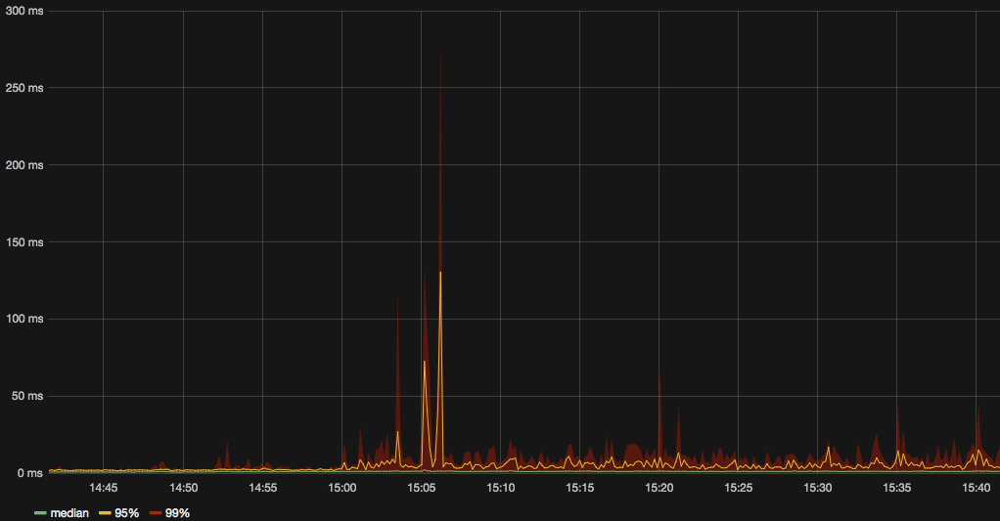

aiodebug
========

This is a tiny library for monitoring and testing asyncio programs.
Its monitoring features are meant to be always on in production.

Aiodebug will use `logwood <https://github.com/qntln/logwood>`_ if it is installed, otherwise it will default
to the standard logging module.

Aiodebug is only tested with Python 3.5. There are no plans to support older versions.

Log warnings when callbacks block the event loop
------------------------------------------------

.. code-block:: python

	aiodebug.log_slow_callbacks.enable(0.05)

This will produce WARNING-level logs such as

.. code-block::

	Executing <Task pending coro=<foo() running at /home/.../foo.py:37>
	wait_for=<Future pending cb=[Task._wakeup()]>> took 0.069 seconds

Asyncio already does this in debug mode, but you probably don't want to enable full-on debug mode in production.

Track event loop lags in StatsD
------------------------------------------------

.. code-block:: python

	aiodebug.monitor_loop_lag.enable(statsd_client)

Tracks how much scheduled calls get delayed and sends the lags to StatsD:

Speed up or slow down time in the event loop
------------------------------------------------

This is mainly useful for testing.

.. code-block:: python

	loop = aiodebug.testing.time_dilated_loop.TimeDilatedLoop()
	asyncio.set_event_loop(loop)

	loop.time_dilation = 3
	await asyncio.sleep(1) # Takes 0.333s of real time

	loop.time_dilation = 0.1
	await asyncio.sleep(1) # Takes 10s of real time
